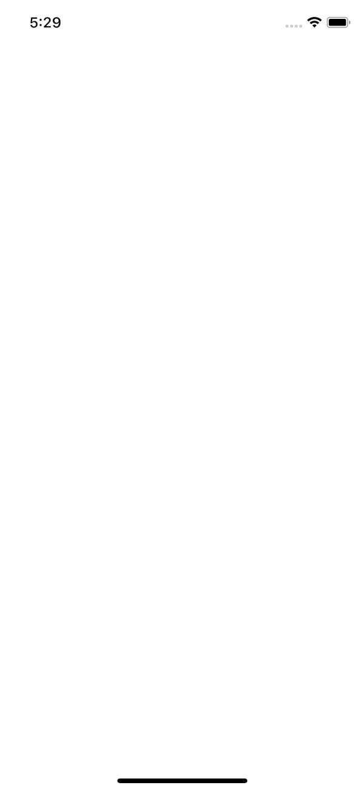

# [Header Interaction with Screen Component](https://reactnavigation.org/docs/en/header-buttons.html#header-interaction-with-its-screen-component)

This is the `js` version from the docs at [here](https://reactnavigation.org/docs/en/header-buttons.html#header-interaction-with-its-screen-component)

```js
class HomeScreen extends React.Component {
  static navigationOptions = ({ navigation }) => {
    return {
      headerTitle: <LogoTitle />,
      headerRight: (
        <Button
          onPress={navigation.getParam('increaseCount')}
          title="+1"
          color="#fff"
        />
      ),
    };
  };

  componentDidMount() {
    this.props.navigation.setParams({ increaseCount: this._increaseCount });
  }

  state = {
    count: 0,
  };

  _increaseCount = () => {
    this.setState({ count: this.state.count + 1 });
  };

  /* later in the render function we display the count */
}
```

In the ReasonML version I could not figure out how to use share the value of the `HomeScreen` state with the incrementing button module. I took a hint from the doc which say:

> React Navigation doesn't guarantee that your screen component will be mounted before the header. Because the increaseCount param is set in componentDidMount, we may not have it available to us in navigationOptions. This usually will not be a problem because onPress for Button and Touchable components will do nothing if the callback is null. If you have your own custom component here, you should make sure it behaves as expected with null for its press handler prop.

> As an alternative to setParams, you could use a state management library (such as Redux or MobX) and communicate between the header and the screen in the same way you would with two distinct components.

So I figured I need some sort of state management solution which I have never used at this point. I remembered [@ken_wheeler] talking about how great [unstated](https://github.com/jamiebuilds/unstated-next) was so I checked github to see if anyone had tried it in `react-native`. I found [@@mirshko](https://mobile.twitter.com/mirshko)'s [unleaded repo](https://github.com/mirshko/unleaded) and go the guidance I needed. While looking around for that I found [re-unstated-next](https://github.com/Raincal/re-unstated-next/blob/master/example/Index.re) by [Yujia](https://mobile.twitter.com/cyj228) which implements `unstated` in ReasonML. You can find that implemented [`src/UnstatedDemo.re`]("./src/UnstatedDemo.re").

Anyway, here is how I got the `state` shared using a library as suggested by the docs. I created the `CounterState.re` module to house my counter's state.

```reason
// straight from https://github.com/Raincal/re-unstated-next/blob/master/example/Index.re
type counter = {
  count: int,
  decrement: unit => unit,
  increment: unit => unit,
};

let useState = initial => {
  React.useReducer((_, action) => action, initial);
};

let useCounter = (~initialState=0, ()) => {
  let (count, setCount) = useState(initialState);
  let decrement = () => setCount(count - 1);
  let increment = () => setCount(count + 1);
  {count, decrement, increment};
};

module Counter =
  UnstatedNext.CreateContainer({
    type state = int;
    type value = counter;
    let useHook = useCounter;
  });
```

In `HomeScreen` module I opened that module with `open CounterState` the created an `IncButton` module for the button I want to pass to `headerRight` in `NavigationOptions` in the `HomeScreen` module. I did this because I need to use `CounterStates` `useContainer` function and didn't want to figure out passing directly in `headerRight`. I then passed the `IncButton` to `headerRight`.

This is the `IncButton` that goes in the header to the right and accesses the state container.

```reason
module IncButton = {
  [@react.component]
  let make = () => {
    let counter = Counter.useContainer();
    <Button title="+" color="#fff" onPress={_ => counter.increment()} />;
  };
};
```

```reason
  make->NavigationOptions.(setNavigationOptions(t(
    // ~title="Home",
    // headerTitle instead of title
      ~headerTitle=NavigationOptions.HeaderTitle.element(<LogoTitle />),
      ~headerRight=<Button title="Info"
        color="#fff" onPress={_e =>
          Alert.alert(~title="This is a button!", ());
        }
      />,
     ())));
```

Then in the `HomeScreen` module we render the current count in the ui with this line where access the count value on `Counter.useContainer`.

```reason
...
<Text>
  {"Count: " ++ string_of_int(Counter.useContainer().count) |> React.string}
</Text>
...
```

The trick to getting this all to work is to make sure that all these modules have access to the state container. I do that by wrapping my reactnavigation `AppContainer` in `<Container.Provider>`, the state container;s provider.

```reason
@react.component]
let make = () =>
  <Counter.Provider initialState=0> <AppContainer /> </Counter.Provider>;
```

This is what it looks like:


