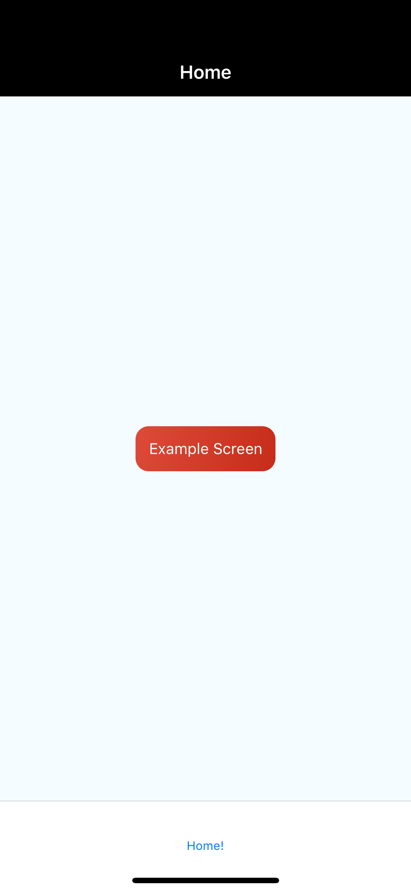

# React Navigation Docs

<https://reactnavigation.org/docs/en/hello-react-navigation.html>

## InitialRouteName on `StackNavigator`

There is no `initialRouteName` config on `StackNavigator` in reason.
The initial screen is the first item in you array, here `Home`. Flip them around to see `Details` rendered first.

## [Navigating to a New Screen](https://reactnavigation.org/docs/en/navigating.html#navigating-to-a-new-screen)

## [Navigating to a Route Multiple Times](https://reactnavigation.org/docs/en/navigating.html#navigate-to-a-route-multiple-times)

 `navigate` doesnt go anywhere because you are already on this page. `push` in js, lets you indicate that you want to go to that screen anyway. I don't know if this is possible with Reason.

```reason
module DetailsScreen = {
  [@react.component]
  let make = (~navigation: Navigation.t) => {
    <Screen name="Details Screen"><Button
        title="Go to Details Screen Again"
        // js version: `onPress={() => this.props.navigation.push('Details')}`
        onPress={_ => navigation->Navigation.navigate("Details")}
      />
    </Screen>;
  };
};
```

## [Going Back](https://reactnavigation.org/docs/en/navigating.html#going-back)

Going back to previous screen in `js`:

```js
<Button
  title="Go back"
  onPress={() => this.props.navigation.goBack()}
/>
```

Going back to previous screen in `reason`:

```reason
<Button
  title="Go back"
  onPress={_ => navigation->Navigation.goBack}
/>
```

## [popToTop](https://reactnavigation.org/docs/en/navigating.html#summary)

`popToTop` take you to the top route in the current stack so this will go back to `Home` route.

```reason
<Button
  title="PopToTop"
  onPress={_ => navigation->Navigation.popToTop}
/>
```

## [Navigation Lifecycle](https://reactnavigation.org/docs/en/navigation-lifecycle.html#example-scenario)

This gif demonstrates how all screens remain mounted even when you navigate away. Notice that on the `HomeStack` we navigate to `Details` then we navigate to the `Settings` stack via the tabs at the bottom. When we navigate back to the `HomeStack` we are still on the `Details` screen in that stack since that is the screen we were on when we left it.


## Passing Props / Json Serializing

Trying this to see if we can work towards json serializable values to use with deeplinking as mentioned here: <https://reactnavigation.org/docs/en/params.html>.

```reason
[@react.component]
  let make = (~navigation: Navigation.t) => {
    // trying this to see if we can work towards json serializable values to use with deeplinking as mentioned here: https://reactnavigation.org/docs/en/params.html
    let bucklescript = {
      "info": {
        itemId: 86,
        otherParam: "anything you want here",
      },
    };

    let param = bucklescript##info;
    Js.log2("TEST", Js.Json.test(param, Object)); // true
    <Screen name="Home Screen">
      <Button
        title="Go to Details"
        onPress={_ =>
          navigation->Navigation.navigateWithParams("Details", param)
          // {"itemId": 86, "otherParam": "anything you want here"},
        }
      />
    </Screen>;
```

## [Setting Header Title](https://reactnavigation.org/docs/en/headers.html#setting-the-header-title)

```js
 static navigationOptions = {
    title: 'Home',
  };
```

```reason
[@react.component]
  let make = (~navigation: Navigation.t) => {
    <Screen name="Home Screen">
      <Button
        title="Go to Details"
        onPress={_ =>
          navigation->Navigation.navigateWithParams("Details", {"itemId": 86, "otherParam": "anything you want here"})
        }>
    </Screen>;
  };
  make->NavigationOptions.setNavigationOptions(NavigationOptions.t(~title="Home", ()));
```

## [Using Params in the Title](https://reactnavigation.org/docs/en/headers.html#using-params-in-the-title)

```js
class DetailsScreen extends React.Component {
  static navigationOptions = ({ navigation }) => {
    return {
      title: navigation.getParam('otherParam', 'A Nested Details Screen'),
    };
  };

  /* render function, etc */
}
```

Use `setDynamicNavigationOptions` and pass in the `params` object. The `title` is on `params##navigation`, here we are you `getParamsWithDefault` to get the value `otherParam` and if not there, use the default.

```reason
[@react.component]
  let make = (~navigation: Navigation.t) => {
    <Screen name="Details Screen">
      /* rest of your component*/
    </Screen>;
  };

  make->NavigationOptions.setDynamicNavigationOptions(params => {
    let title = params##navigation->Navigation.getParamWithDefault("otherParam", "A Nested Details Screen");
    (NavigationOptions.t(~title, ()));
  });
```

## [Updating `navigationOptions` with `setParams`](https://reactnavigation.org/docs/en/headers.html#updating-navigationoptions-with-setparams)

```js
        <Button
          title="Update the title"
          onPress={() =>
            this.props.navigation.setParams({ otherParam: 'Updated!' })}
        />
```

The [`reason-react-navigation`](https://github.com/reasonml-community/reason-react-native/blob/scrolltoexample/reason-react-navigation/src/Navigation.re) bindings haven't implemented `setParams` yet I had to spin some up to ge this demo done. If you look at the `js` version above, it calls `setParams` which takes a `json` object with a `key` and a `value`. In keeping with how the bindings are written, we can reproduce the passed in value using [`bucklescripts`](https://bucklescript.github.io/docs/en/object-2#creation) object creation method. That is what I did below in the `reason` example. I messed with it for a bit, unsuccessfully, before I jumped into the [reason-discord](https://discord.gg/RQ7vZ3) channel and asked the question. [John Jackson](https://johnridesa.bike/) the author of the ReasonML chess game [coronate](https://github.com/johnridesabike/coronate) chimes in wiht the link to the `bucklescript` docs. This worked immediately. The problem now is getting this one function to work with the `reason-react-navigation` bindings we are using for all these demos. I ended up creating a module `NavUtils.re` with two lines of code. An `include` reference to the `ReactNavigation.Navigation` module which copies every thing from that module to the current one. So in the end, we have all of `ReactNavigation.Navigation` plus our new `setParams` function. You can apparently, now use either `NavUtils` or `ReactNavigation.Navigation` interchangeably.

```reason
include ReactNavigation.Navigation;
[@bs.send] external setParams: (t, Js.t({..})) => unit = "setParams";
```

```reason
[@react.component]
  let make = (~navigation: Navigation.t) => {
    // create a `bs.obj` that we will pass to `setParams`
    // typing is Js.t(< otherParam : string >) which matches the type we wrote in our `NavUtils` module, which was `Js.t({..})`. When you see the doulbe dots, tell yourself, that is the type for the `Bucklescript interop object`
    let params = {"otherParam": "Updated!"};

    <Screen name="Details Screen">
      <Button
        title="Update the title"
        onPress={_ =>
          navigation->NavUtils.setParams(params)
        }
      />
      /* rest of your component*/
    </Screen>;
  };

  make->NavigationOptions.setDynamicNavigationOptions(params => {
    let title = params##navigation->Navigation.getParamWithDefault("otherParam", "A Nested Details Screen");
    (NavigationOptions.t(~title, ()));
  });
```

## [Adjusting header styles](https://reactnavigation.org/docs/en/headers.html#adjusting-header-styles)

From the docs:
> There are three key properties to use when customizing the style of your > header: `headerStyle`, `headerTintColor`, and `headerTitleStyle`.

> `headerStyle`: a style object that will be applied to the View that wraps the header. If you set backgroundColor on it, that will be the color of your header.

> `headerTintColor`: the back button and title both use this property as their color. In the example below, we set the tint color to white (#fff) so the back button and the header title would be white.

> `headerTitleStyle`: if we want to customize the `fontFamily`, `fontWeight` and other Text style properties for the title, we can use this to do it.

```js
class HomeScreen extends React.Component {
  static navigationOptions = {
    title: 'Home',
    headerStyle: {
      backgroundColor: '#f4511e',
    },
    headerTintColor: '#fff',
    headerTitleStyle: {
      fontWeight: 'bold',
    },
  };

  /* render function, etc */
}
```

Using ReasonML:

```reason
[@react.component]
  let make = (~navigation: Navigation.t) => {
    <View
      style=Style.(
        style(~flex=1., ~alignItems=`center, ~justifyContent=`center, ())
      )>
      <Text> {"Home Screen" |> React.string} </Text>
      /* rest of your component*/
    </View>;
  };

    make->NavigationOptions.setNavigationOptions(
    NavigationOptions.t(
      ~headerTitleStyle=Style.(style(~fontWeight=`bold, ())),
      ~headerTintColor="#fff",
      ~headerStyle=Style.(style(~backgroundColor="#f4511e", ())),
      ~title="Home",
      (),
    ),
  );
  // alternatively, define the prop and pass it to `NavigationOptions`
  // let headerStyle = Style.(style(~backgroundColor="#f4511e", ()));
  // let headerTitleStyle = Style.(style(~fontWeight=`bold, ()));
  // let headerTintColor = "#fff";
  // make->NavigationOptions.setNavigationOptions(
  //   NavigationOptions.t(
  //     ~headerTitleStyle,
  //     ~headerTintColor,
  //     ~headerStyle,
  //     ~title="Home",
  //     (),
  //   ),
  // );
```

## [Sharing common `navigationOptions` across screens](https://reactnavigation.org/docs/en/headers.html#sharing-common-navigationoptions-across-screens)

From the docs:
> There are three key properties to use when customizing the style of your > header: `headerStyle`, `headerTintColor`, and `headerTitleStyle`.

> `headerStyle`: a style object that will be applied to the View that wraps the header. If you set backgroundColor on it, that will be the color of your header.

> `headerTintColor`: the back button and title both use this property as their color. In the example below, we set the tint color to white (#fff) so the back button and the header title would be white.

> `headerTitleStyle`: if we want to customize the `fontFamily`, `fontWeight` and other Text style properties for the title, we can use this to do it.

```js
class HomeScreen extends React.Component {
  static navigationOptions = {
    title: 'Home',
    headerStyle: {
      backgroundColor: '#f4511e',
    },
    headerTintColor: '#fff',
    headerTitleStyle: {
      fontWeight: 'bold',
    },
  };

  /* render function, etc */
}
```

Using `ReasonML` I had to do a few things to get this to work. The `reason-react-navigation` bindings don't have `initialRouteName` and `defaultNavigationOptions` so I created [StackUtils.re]("./src/bindings/StackUtils.re") which copies over all of `ReactNavigation.StackNavigator`  and overides the definition of `config` so that it has just the properties from `react-navigation` that I need to reproduce the example. It looks like this:

```reason
// include this file: https://github.com/reasonml-community/reason-react-native/blob/53dc7f9ebf6ae72fb88c2cfe957dc45b993265fa/reason-react-navigation/src/StackNavigator.re then override `config` definition
include ReactNavigation.StackNavigator;

[@bs.obj]
external config:
  (
    ~initialRouteName: string=?,
    ~defaultNavigationOptions: Js.t('a)=?,
    unit
  ) =>
  config =
  "";
```

Then I removed the `NavigatorOptions` calls from the `HomeScreen` and `DetailsScreen` modules and defined them in the `routes` object in `AppContainer`. I then use `StackUtils` to define our config object that we pass to `StackNavigator.makeWithConfig()`;

```reason
module AppContainer =
  AppContainer.Make({
    type screenProps = {. "someProp": int};

    let routes = {
      "Home": {
        screen: HomeScreen.make,
        navigationOptions: () => {
          title: "Home",
        },
      },
      "Details": {
        screen: DetailsScreen.make,
        navigationOptions: (params: {. navigation: Navigation.t}) => {
          let navigation = params##navigation;
          let title =
            navigation->Navigation.getParamWithDefault(
              "otherParam",
              "A Nested Details Screen",
            );
            // here we have to do `title:title` or change the name of `let title` identifier because the compiler will pun it away to `title` instead of `{title}` which compiles it away.
            {
              title:title,
            };
        },
      },
    };
    // create a `Js.t('a)` object containing the values we want to use as `defaultNavigationOptions`.
    let configFromHomeScreen = {
      "headerStyle": Style.(style(~backgroundColor="#f4511e", ())),
      "headerTintColor": "#fff",
      "headerTitleStyle": Style.(style(~fontWeight=`bold, ())),
    };
    // define our `config` object passing in `configFromHomeScreen` to `~defaultNavigationOptions`
    let configOptions = StackUtils.config(
        ~initialRouteName="Home",
        /* The header config from HomeScreen is now here */
        ~defaultNavigationOptions=configFromHomeScreen,
        (),
      );
    let navigator = StackNavigator.(makeWithConfig(routes, configOptions));
  });
```

This is what it looks like:


## [Configuring `navigationOptions`](https://reactnavigation.org/docs/en/headers.html#sharing-common-navigationoptions-across-screens)

```js
const Home = createStackNavigator(
  {
    Feed: ExampleScreen,
    Profile: ExampleScreen,
  },
  {
    defaultNavigationOptions: {
      title: 'Home',
      headerTintColor: '#fff',
      headerStyle: {
        backgroundColor: '#000',
      },
    },
    navigationOptions: {
      tabBarLabel: 'Home!',
    },
  }
);
```

### Define the routes seperately for readability

```reason
  let routes = {
    "Feed": {
      screen: ExampleScreen.make,
    },
    "Profile": {
      screen: ExampleScreen.make,
    },
  };
```

### Define the defaultNavigationOptions seperately for readability

```reason
  let defaultNavigationOptions = {
    "title": "Home",
    "headerTintColor": "#fff",
    "headerStyle": Style.(style(~backgroundColor="#000", ())),
  };
```

### Use StackUtils version of `StackNavigator.config` which has the `defaultNavigationOptions` option available on it.

```reason
  let configOptions =
    StackUtils.config(
      ~defaultNavigationOptions,
      (),
    );
```

### Generate Config

Notes: `tabBarLabel` is represented in the binding as `title` as far as I can tell. There is a `TabBarLabel` module  but I can not get it to pass in this format yet. Instead, I used the `setNavigationOptions` method from the bindings found here: https://github.com/reasonml-community/reason-react-native/blob/21a72c601c12adaf09ebd0cd55d57ecb59a650f8/reason-react-navigation/src/NavigationOptions.re#L165 which is having the desired effect apparently.

Use StackUtils version of `StackNavigator.config` which has the `defaultNavigationOptions` option available on it.

```reason
  let configOptions =
    StackUtils.config(
      ~defaultNavigationOptions,
      (),
    );
```

### Create the `navigator`

Pass the `routes` and `config` to our `StackNavigator`

```reason
  let navigator = StackNavigator.(makeWithConfig(routes, configOptions));
```

### Use `setNavigationOptions` from bindings

Use `setNavigationOptions` to create the title per the demo. See notes above on `tabBarLabel`. The `title` property here overrides the `tabBarLabel` title, not the `title` we set in `defaultNavigationOptions`.

```reason
  navigator->NavigationOptions.setNavigationOptions(
    NavigationOptions.t(~title="Home!", ()),
  );
```

All together:

```reason
module Home = {
  // define the routes seperately for readability
  let routes = {
    "Feed": {
      screen: ExampleScreen.make,
    },
    "Profile": {
      screen: ExampleScreen.make,
    },
  };

    // define the defaultNavigationOptions seperately for readability

  let defaultNavigationOptions = {
    "title": "Home",
    "headerTintColor": "#fff",
    "headerStyle": Style.(style(~backgroundColor="#000", ())),
  };
  // `tabBarLabel` is represented in the binding as `title` as far as I can tell. There is a `TabBarLabel` module  but I can not get it to pass in this format yet. Instead, I used the `setNavigationOptions` method from the bindings found here: https://github.com/reasonml-community/reason-react-native/blob/21a72c601c12adaf09ebd0cd55d57ecb59a650f8/reason-react-navigation/src/NavigationOptions.re#L165 which is having the desired effect apparently.

  // use StackUtils version of `StackNavigator.config` which has the `defaultNavigationOptions` option available on it.
  let configOptions =
    StackUtils.config(
      ~defaultNavigationOptions,
      (),
    );

  // pass the `routes` and `config` to our `StackNavigator`
  let navigator = StackNavigator.(makeWithConfig(routes, configOptions));
  // use `setNavigationOptions` to create the title per the demo. See notes above on `tabBarLabel`. The `title` property here overrides the `tabBarLabel` title, not the `title` we set in `defaultNavigationOptions`.
  navigator->NavigationOptions.setNavigationOptions(
    NavigationOptions.t(~title="Home!", ()),
  );
};
```

This is what it looks like:


